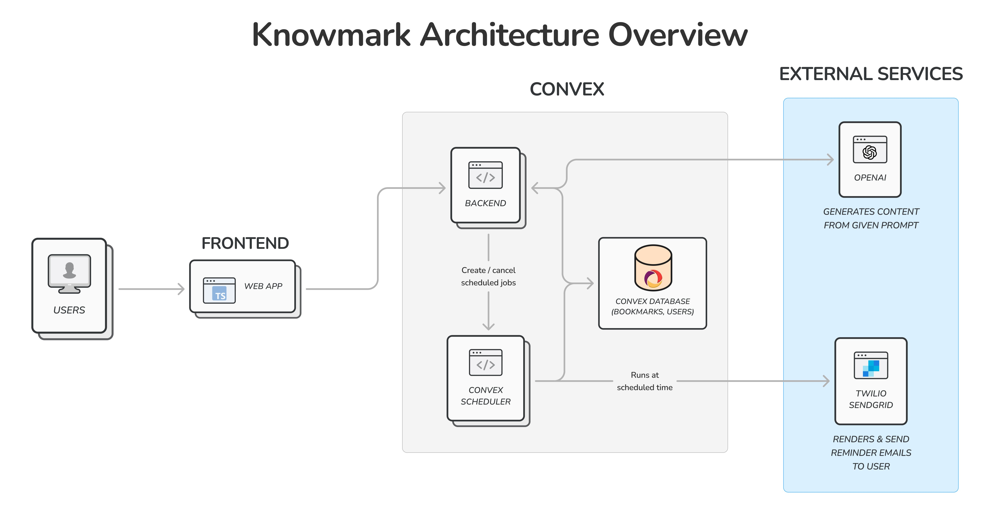

# Knowmark
**An AI-powered platform that helps ADHD and neurodivergent learners organize and rediscover saved links with context.**

## 🚀 Overview
Knowmark transforms "bookmark graveyards" into an actionable, context-aware library.  
Instead of just storing links, Knowmark restores the missing context behind each saved item — *what it is, why it mattered, and what to do next* — making it easier to revisit content without feeling overwhelmed.  
See my presentation [here](https://www.canva.com/design/DAHCftAs6U4/MZkwy62flVF3s6YgwME7Cg/edit?utm_content=DAHCftAs6U4&utm_campaign=designshare&utm_medium=link2&utm_source=sharebutton).

## 🧠 The Problem
Saving links is easy, but revisiting them isn’t.
Many learners (especially those with executive-function challenges) save screenshots, articles, and resources for "later", but:
- Forget they exist
- Forget why they saved them
- Feel overwhelmed by the huge collection
- Avoid revisiting entirely

The real problem isn’t storage — it’s **context loss + follow-through friction**.

## 💡 The Solution

Knowmark uses AI to enrich bookmarks with structured context and lightweight nudges.

### 🔖 Key Features
- Bulk import + duplicate filtering
- AI-powered auto-tagging (topic classification)
- 1-line summaries + TL;DR to preserve context
- Scheduled reminders with estimated reading effort
- Context restoration: what it is, why it mattered, and what to do next

## 💻 Tech Stack
| Layer | Technology | Purpose |
|-------|------------|----------|
| Frontend | React + TypeScript (Vite) | UI & user interaction |
| Backend | Convex | Serverless backend, data storage + scheduling |
| AI | OpenAI API | Bookmark summaries + tagging |
| Email | Twilio SendGrid | Reminder notifications |
| Prompt Workflow | Vibeflow | Structured AI pipeline |
| Design | Figma | UI + flow planning |

## 🏗 Architecture Overview

1. User imports bookmarks
2. System removes duplicates
3. OpenAI generates summaries + topic tags
4. Bookmark & metadata stored in Convex DB
5. Schedule reminders through web app & triggered via SendGrid

## 🔮 Future Improvements
If given more time, I would:
- Build a Chrome extension for seamless bookmark syncing
- Add semantic search (embeddings) for faster rediscovery
- Introduce analytics (review stats like “Spotify Recap” for saved content)
- Enable shared libraries for peer collaboration
- Run lightweight user testing + iterate on UX
